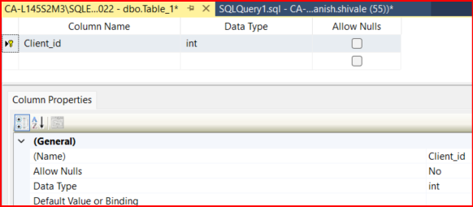
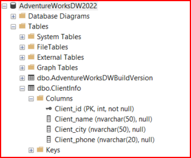
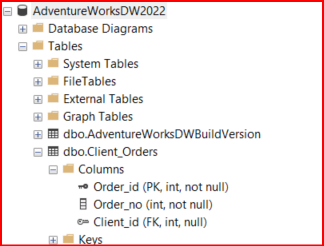
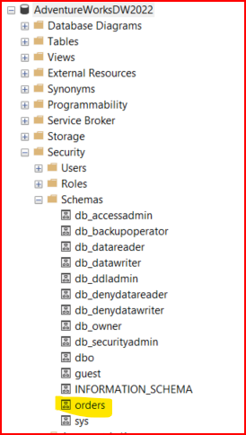

# OBJECTIVE 01:

  ## **Demonstrate how to create a table using Transact-SQL statement**

  - Table designer can be used to create table as well.
  - It is crucial to select right database in which you would like to create table.



  - while using T-SQL, we need to mention which database we are using and then run create table query.
  - It is recommended to check if the table already exists, however we have not learned IF query yet. However we can try this:

  ```sql 

    IF OBJECT_ID('AdventureWorksDW2022.dbo.ClientInfo', 'U') IS NOT NULL
    DROP TABLE AdventureWorksDW2022.dbo.ClientInfo;
    GO

    -- U stands for user table

  ```
  

  - While using T-SQL, directly mention which database you want table to be in.
  - default schema owner would be dbo.
  - we do not need to mention NULL for each column it is implict checked option.

  ### Where do I define Primary and Foreign key while creating table.

  Preferable syntax is:

  ```sql

  CREATE TABLE TableName (
    Column1 DataType PRIMARY KEY,
    Column2 DataType,
    ForeignColumn DataType,
    CONSTRAINT FK_ConstraintName FOREIGN KEY (ForeignColumn) REFERENCES OtherTable(OtherColumn)

  -- we can skip CONSTRAINT FK_ConstraintName as it is custom name for constraint
);

  ```
  


# OBJECTIVE 02:

  ## **Demonstrate how to create a schema using Transact-SQL statement**

- By default, when we create a schema in SQL server, it is owned by the user created it, typically the dbo user.
- However, we can specify the schema owner using AUTHORIZATION clause.




# OBJECTIVE 03:

  ## **Review the table created in the first task to ensure it is normalized**

- From a normalization perspective, foreign key constraints play a role in maintaining referential integrity between tables. 
- foreign key ensure that values in the referencing table correspond to valid values in the referenced table
