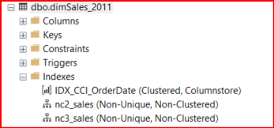
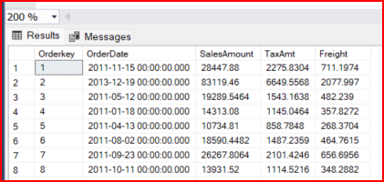
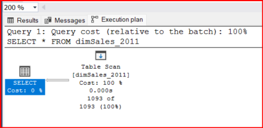
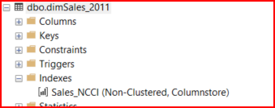
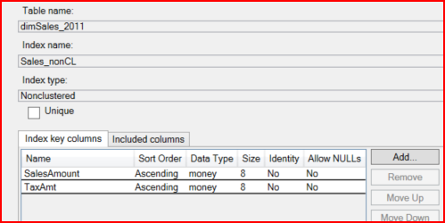

# OBJECTIVE 01:

  ## **Demonstrate how to create a clustered columnstore index for a large dimension table**


    -- ColumnStore is a logical table with rows and columns, phyiscally stored in a column-wise format.

    -- Columnar format enables 

        - better data compression, 
        - reducing storage requirements and 
        - improve overall query performance.

    -- Dimension table:

        - suppose we have a fact table named 'Sales' that records individual sales transactions. Each row in the Sales table represent single transaction and include information such as the product sold, date of sale, qty sold and total sales amount.

        now let's say we want to analyze our sales data to understand trends across different dimensions such as time, product categories and customer demographics. To do this we can create dimension tables for each of these dimensions.

        - they are often used for slicing, dicing and filtering data in analytical queries.

    **syntax**

      ```sql

          create clustered columnstore index index_name
          on [[schema_name].table_name]
          [with ( <with_option> [,....n ])]
          [on <on_option>]
          [;] 

        /*
          <with_option>:

            DATA_COMPRESSION = 'NONE' or 'ROW' or 'PAGE' or 'COLUMNSTORE'
              - specify the level of compression

            MAXDOP
              - specify the max number of processors that can be used concurently for index operation.

            DROP_EXISTING = 'ON'
              - existing index will be dropped before the new index is created.

            SORT_IN_TEMDB
              - specify whether the sort operation required for creating or rebuilding the index should occur in tempdb database instead of user database.

        */
      ```

    -- clustered index for dimension table dbo.dimSales_2011
    


    -- clustered columnstore index for dimension table dbo.dimSales_2011


# OBJECTIVE 02:

  ## **Demonstrate how to define a nonclustered index on a clustered columnstore index**


  -- we can create multiple non clustered index in a database to search the database efficiently and quickly.




# OBJECTIVE 03:

  ## **Demonstrate how to create a nonclustered columnstore index for real time performance analysis**

    -- Real-time operational analytics includes:
        - OLAP : online analytical processing
        - OLTP : online transactional processing
    
    -- Real-time operational analytics in the context of database involves leveraging database systems to perform analytical tasks and transactional processing concurently on the same dataset.

    -- Real-time operational analytics relies on columnstore indexes in db.
        - by creating nonclustered columnstore indexes on transactional tables,
          - organizations can efficiently run analytical queries
          - alongside run transactional operations without performance degradation.








