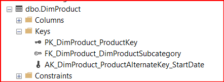
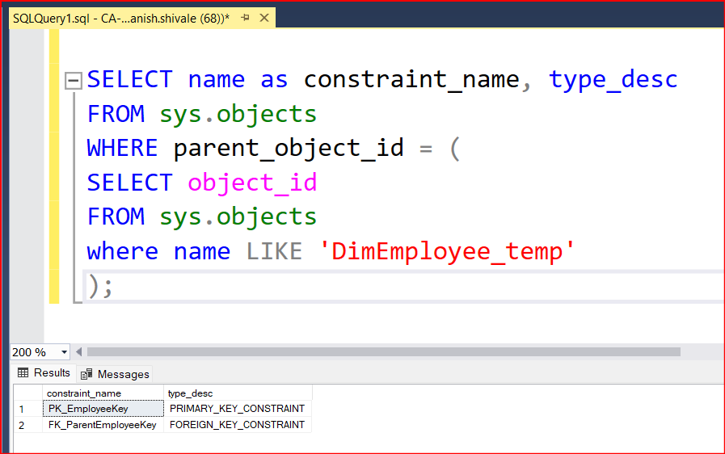
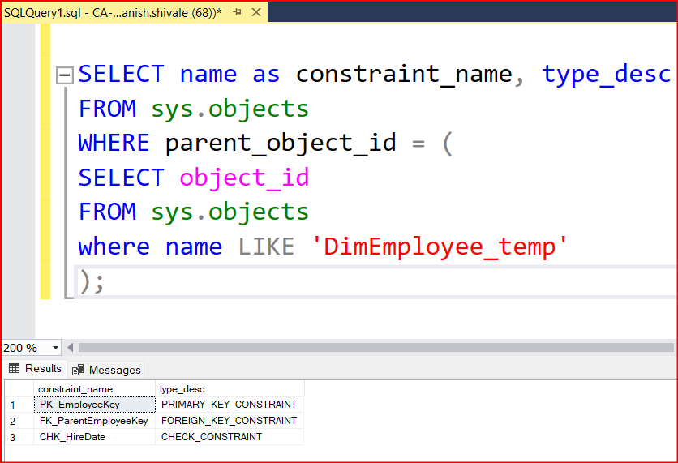

# OBJECTIVE 01:

## **Demonstrate how to define a column as primary key for an existing table.**

- Primary key column unqiuely defines the record in a database table.
- One can enter duplicate values in the primary key column
- In one table, there should be only 1 primary key constraint: _check image below_
- primary key columns should never contain null values



# OBJECTIVE 02:

## **Demonstrate how to define a column as FOREIGN key referring to another column in the same table**

- We can create foreign key constraints to establish relationships between or within tables in the database.
- Foreign key columns accept only those values that exist in the primary key columns.
- Foreign key columns can contain Null values
  - it means that row in the child table (table containing foreign key) may or may not have a corresponding row in the parent table (table containing the primary key)
  - this null value indicates where the relationship is not established.
  - this does not violate referential integrity.
- Non null values indicates that there relationship between child and parent is valid and maintains referential integrity.

### Why need foreign column referencing primary key in same table

- This concept known as self-referencing relationship.
- This design pattern is commonly used in database for
  - Hierarchial data:
    - each row can have a relationship with another row within the same table.
    - instead of creating another table to represent hierarchial relationships, use self-referencing foreign key.
- Look at following creation of table with constraint definition

```sql
  CREATE TABLE Employee (
    Employee_ID INT PRIMARY KEY,
    Name VARCHAR(100),
    ManagerID INT,
    CONSTRAINT FK_Manager FOREIGN KEY (ManagerID) REFERENCES Employee(EmployeeID)
  )

  INSERT INTO Employee (EmployeeID, Name, ManagerID)
VALUES
  (1, 'John Doe', NULL),       -- John Doe is the CEO (no manager)
  (2, 'Jane Smith', 1),         -- Jane Smith reports to John Doe
  (3, 'David Johnson', 2),      -- David Johnson reports to Jane Smith
  (4, 'Emily Brown', 2);        -- Emily Brown also reports to Jane Smith


```

- Insert operation shows how EmployeeId is being used as ManagerID in the same table and showing relationship.
- We can define forign key constraint after table creation as well

```sql
  ALTER TABLE Employee
  ADD CONSTRAINT FK_Manager FOREIGN KEY (ManagerID) REFERENCES Employee (EmployeeID)

```

- Constraints for DimEmployee_temp created as sample table under this objective.



# OBJECTIVE 03:

## **Demonstrate how to define a column as FOREIGN key referring to another table in the same database**

```sql
  ALTER TABLE FactInternetSales_temp
  ADD CONSTRAINT
                FK_DimProduct_FactInternetSales
                FOREIGN KEY (ProductKey)
                REFERENCES DimProduct_temp (ProductKey)
  GO

```
# OBJECTIVE 04:

## **Demonstrate how to create a check constraint on one of the columns in an existing table**

- CHECK constraints are enforced by DBMS whenever data is inserted or updated in the table.
- If a constraint is violated, DBMS will prevent the operation and return an error message.
- CHECK constraints maintain data integrity at database level.
- We can alter or remove check constraints using ALTER TABLE and DROP CONSTRAINT sql commands.
- For example: if AGE INT needs to be between 18 and 60
  ```sql 
      CREATE TABLE Employee(
        EmployeeID INT PRIMARY KEY,
        Name VARCHAR (100),
        Age INT,
        CHECK (Age BETWEEN 18 AND 60)
      );
  ```
  - Proper way to define it
    - give proper name: CONSTRAINT constraint_name
    - define condition: CHECK (condition)
    - 2 ways to write it with column
    ```sql
      Age INT,
      CHECK (Age BETWEEN 18 AND 60)

      AGE INT CHECK (AGE BETWEEN 18 AND 60)

      AGE INT,
      CONSTRAINT CHK_AgeRange CHECK (Age BETWEEN 18 AND 60)
    ```
  - Check constraints can be applied at table level as well wherein constraint is applied to one or more columns in the table when the table is defined.

  - CHECK CONSTRAINT on HireDate Column


# OBJECTIVE 05:

## **Demonstrate how to create a unique constraint on one of the columns in an existing table**

  - Unique constraint maintains that no two rows in a table have the same values in specified columns.
  - Unique constraint are commonly used for columns that serve as natural keys:
    - email addresses
    - usernames
    - social security numbers
  - behind the scenes, unique constraints are often implemented using indexes.
  - however, insertion and update performance would be slighly impacted due to need for index maintenance.
    - Proper way to define it
    - give proper name: CONSTRAINT constraint_name
    - define condition: UNIQUE (condition)
    ```sql
        -- Syntax for defining a unique constraint during table creation
        CREATE TABLE table_name (
            column1 datatype CONSTRAINT constraint_name UNIQUE,
            column2 datatype,
            ...
        );

        -- Syntax for adding a unique constraint using ALTER TABLE
        ALTER TABLE table_name
        ADD CONSTRAINT constraint_name UNIQUE (column1, column2, ...);


    ```