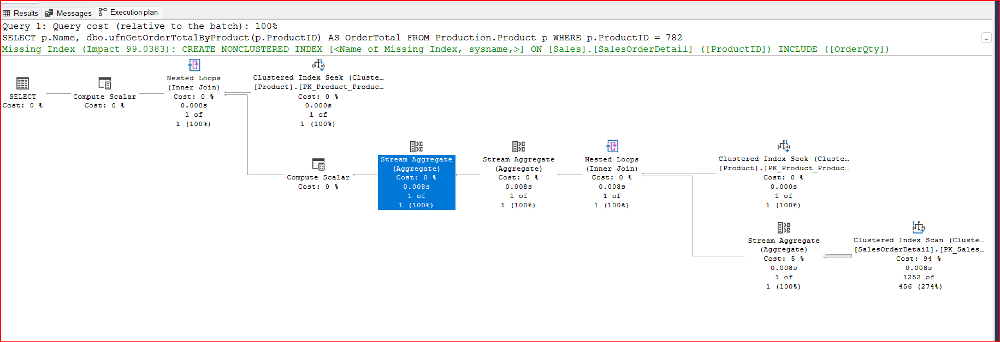
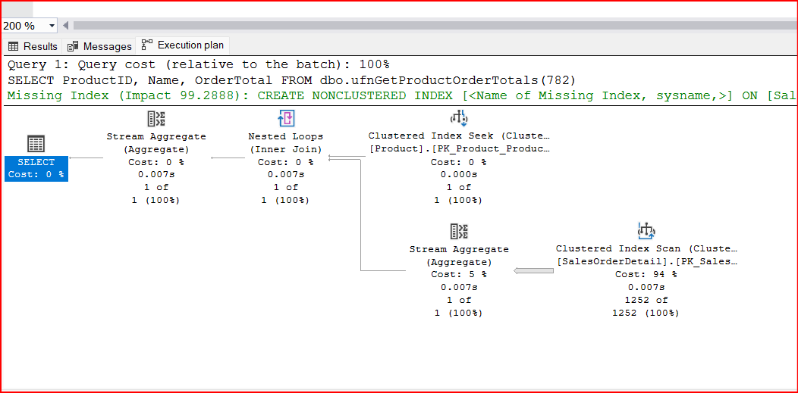

# SCALAR FUNCTIONS

## Syntax

```sql
    CREATE FUNCTION FunctionName (
        InputParameter1 DataType, 
        InputParameter2 DataType = OptionalValue)
    RETURNS DataType
    AS
    BEGIN
        CODE;
        RETURN Expression;
    END
```

## Input Paramaters

- Parameters with default do not become optional paramaters.

- Call function, pass the keyword DEFAULT to the function.

```sql
    -- Calling the function
    SELECT dbo.FunctionName(InputParameter1, DEFAULT);
```

## Limitations of using scalar function.

- Deterministic: Function must return repeatedly the same value for same input parameters.

- Nondeterministic functions such as newid() and rand() are not allowed within scalar functions.

- Do not use user defined functions to
    - update the database
    - call stored procedures
    - call DBCC commands

- Scalar function must not return BLOB such as text, image, timestamp, ntext.

- Scalar function must not return table variables or cursor data types.

- For Error handling, user defined functions may not include TRY__CATACH or RAISERROR.

- AVOID NESTING functions.

# INLINE TABLE VALUED FUNCTIONS

## Syntax

```sql
    CREATE FUNCTION FunctionName (
        InputParameter1 DataType)
    RETURNS TABLE
    AS
        RETURN (SELECT statements);

```
- Syntax does not include Begin_End. It directly return a set of fields.

# Comparision with Scalar function

Scalar Function Execution Plan


Inline Table Valued Function Execution Plan


- The scalar function dbo.ufnGetOrderTotalByProduct(@ProductID INT) and inline tvf dbo.ufnGetProductOrderTotals(@ProductID INT) can produce the same result set.

- Scalar function fires once per row, whereas the inline tvf is treated by query optimizer much like a view.

- It is growing thought that because of this treatment by the query optimizer, it is prefereable to use inline tvf wherever possible.

# MULTISTATEMENT TABLE VALUED FUNCTIONS

## Syntax

```sql
    CREATE FUNCTION FunctionName (
        InputParameter1 DataType)
    RETURNS @TableName TABLE (Columns)
    AS
    BEGIN
        -- CODE TO POPULATE TABLE VARIABLE
        RETURN;
    END;

```

# MAXIMIZING PERFORMANCE

## Basic Guidelines

- Choose inline table-valued functions over multistatement table-valued functions.

- Even if it looks like you need a scalar function, write it as inline table valued function.

- Avoid scalar functions wherever possible.

- You need multistatement table-valued function, check to see if a stored procedure might be the appropriate solution.

-   User defined functions are not a standard replacement for subqueries, views or stored procedures.

- User defined functions provides benefit in case such as paramterization or reusability.