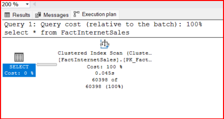
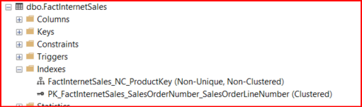
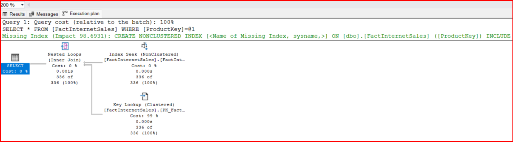
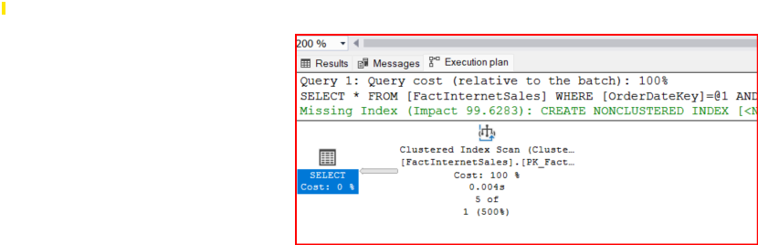
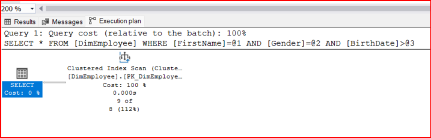
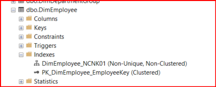
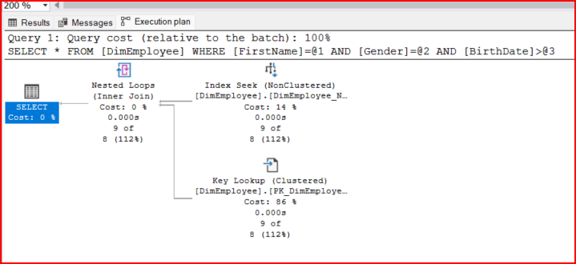

# OBJECTIVE 01:

  ## **Demonstrate how to create indexes based on the given tables, queries**

- SQL offers indexes as solution that increases the query performance and reduce data retreival time.
- two types of indexes are

  - clustered index
    - there can be only one per table.
    - this is created when a primary key constraint is defined for a field in table.

    - syntax
    ```sql
        CREATE CLUSTERED INDEX <index_name> ON <table_name> (column_name)
    ```

  - nonclustered index
    - it stores a pointer to the row in the source table where the value is actually stored.
    - a table can have multiple non-clustered index.

    - syntax
    ```sql
        CREATE NONCLUSTERED INDEX <index_name> ON <table_name> (column_name)
    ```

- we can check the execution plan of each time we run query before and after clustered and or nonclustered index are created.

- query with **include the execution plan** prior to index creation



- this image shows the clustered index already created with primary key and nonclustered index I created



- query with **include the execution plan** after to index creation




  -- OBSERVATION:
  - After creating nonclustered index, there was a impact on lookup cost, though minimal, it reduced to 98.6%
  - it is giving further tips on including more columns as indexes.


# OBJECTIVE 02:

  ## **Demonstrate how to create a non-clustered index with key columns**

- Indexing the key columns of the table helps the query to locate the record easily.
- Indexed key columns are included in the WHERE clause of the SELECT statement.

- query with **include the execution plan** prior to non-clustered creation




- nonclustered index with key columns


- query with **include the execution plan** after nonclustered index with key columns creation


# OBJECTIVE 03:

  ## **Demonstrate how to create a non-clustered index with included non-key columns**

-- query with **include the execution plan** before nonclustered index with non-key columns creation




-- nonclustered index with non key columns




-- query with **include the execution plan** after nonclustered index with non-key columns creation



  **OBSERVATION**

    - key lookup for clustered index cost is reduced to 86%.
    - the index seek cost of non-clustered index is at 14%.

  **CONCLUSION**

    Based on these observations, it can be concluded that both the clustered index and the non-clustered index are performing well. The reduced key lookup cost for the clustered index implies that accessing individual rows directly from the clustered index is efficient, while the low cost of the index seek for the non-clustered index indicates that it is effective in quickly locating specific rows based on the search conditions. 
    
    Overall, these observations suggest that the indexes are contributing positively to the query performance.