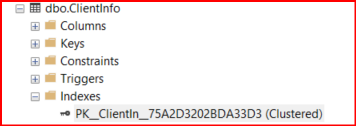
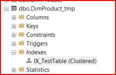

# OBJECTIVE 01:

  ## **Demonstrate how creating a clustered index on a varchar column which has existing data in the IN_ROW_DATA allocation unit affects subsequent insert or update actions on the column**

- Difference between three different allocation units

  - IN_ROW_DATA:  the portion of data that fits within the fixed-size rows of a database page.

  - ROW_OVERFLOW_DATA: data that exceeds the maximum row size limit and is stored separately from the main row structure.

  - LOB_DATA: data that stores large size data such as text, images etc

- ClientInfo allocation units when clustered index was from primary key ie client_id

|   name      | AU_type     | total_pages | data_pages | used_pages |
|-------------|-------------|-------------|------------|------------|
| ClientInfo  | IN_ROW_DATA |      0      |      0     |      0     |

  - currently ClientInfo does not have any allocated pages.

- FactInternetSales allocation units when clustered index as primary key.

  - based on different criteria such as partition or storage configuration there are 3 rows.

| name             | AU_type     | total_pages | data_pages | used_pages |
|------------------|-------------|-------------|------------|------------|
| FactInternetSales | IN_ROW_DATA | 1345        | 1239       | 1257       |
| FactInternetSales | IN_ROW_DATA | 233         | 217        | 219        |
| FactInternetSales | IN_ROW_DATA | 257         | 247        | 251        |

*What is important that; both tables have only IN_ROW_DATA*

### If another clustered index is made with varchar column.

- Clustered Index on varchar column

- DimProduct_tmp allocation units when clustered index is varchar column.

| name           | AU_type           | total_pages | data_pages | used_pages |
|----------------|-------------------|-------------|------------|------------|
| DimProduct_tmp | IN_ROW_DATA       | 377         | 355        | 362        |
| DimProduct_tmp | LOB_DATA          | 497         | 0          | 486        |
| DimProduct_tmp | ROW_OVERFLOW_DATA | 0           | 0          | 0          |

# OBJECTIVE 02:

  ## **Demonstrate how creating clustered indexes on a table followed by several nonclustered indexes is the best practice rather than creating several nonclustered indexes on a table followed by a clustered indexes**

- ### evaluate your indexing needs:
    Determine if the default clustered index (usually created on the primary key column) is suitable for your database workload. If your queries frequently involve range scans, sorting, or sequential access, the default clustered index might be sufficient. However, if your queries mainly involve lookups based on different columns, you might benefit from creating nonclustered indexes on those columns.

- ### Consider Primary Key vs. Clustered Index
  While the primary key is often used as the clustered index key, they are not synonymous. You can have a primary key constraint without a clustered index, and vice versa. If you decide to create multiple nonclustered indexes and want to change the clustered index key, you can drop the existing clustered index and then recreate it with a different key or create a new clustered index on another column.

- ### Rebuild Indexes <*very_important_concepts*>
  - Creation of Nonclustered Indexes: Each nonclustered index you create adds additional overhead to the database because it needs to maintain its own separate data structure for efficient searching. These structures can become fragmented as data is inserted, updated, or deleted in the underlying table.

  - Subsequent Creation of Clustered Index: When you create a clustered index after the nonclustered indexes, it rearranges the physical order of the data in the table to match the order of the clustered index key. This rearrangement can cause further fragmentation, especially if the table already contains a significant amount of data.

  - Fragmentation and Inefficiency: Fragmentation occurs when data pages are not contiguous or ordered logically, leading to wasted space and increased disk I/O during data retrieval operations. This fragmentation can degrade query performance and increase storage requirements.

  - Regular Maintenance Required: To address this fragmentation and maintain optimal performance, it's essential to regularly monitor and maintain indexes by rebuilding or reorganizing them as needed. This maintenance helps reorganize data pages and improve storage efficiency, leading to better query performance.
