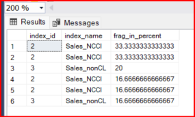
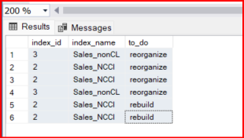

# OBJECTIVE 01:

  ## **Demonstrate how to reorganize a columnstore index**

  ### INDEX FRAGMENTATION

  -  After one or more data loads, the information in the index become scattered in a database. This is known as index fragmentation.
  - This reduce query and then application performance.
  - Solution to fix this: 
    - Reorganize or Rebuild the respective index.
  
  Demonstration is given below:

  - In [Queries.sql](DB01_Developing_a_SQL_Databases\SQL_04_Creating_Columnstore_Indexes\Queries.sql), we have created columnstore index for dimSales_2011.

  - Use table-valued function: sys.dm_db_index_physical_stats
    - returns information about the physical characteristics of indexes.
    - useful for analyzing the fragmentation and storage of indexes in a database.
    - arguments of function:
      - Database_id (int)
        - optional
        - DB_ID(N'')
      - object_id(int)
        - optional
        - OBJECT_ID(N'')
      - index_id(int)
        - optional
        - NULL
      - partition_id (int)
        - optional
        - NULL
        - get number of partition.
      - mode (int)
        - Set 1: Get detailed stats.
        - Set 0: Get basic stats.
        - NULL
    - N'': N: The uppercase letter "N" is a prefix that stands for National Language Character Set. When you precede a string literal with N, you're telling SQL Server that the string is a Unicode string. '': This is an empty string literal enclosed in single quotes. It represents an empty Unicode string.

  What we are getting is based on this logic:
  - get index id, index name and average fragmentation in percent
  - Condition:
    - filter to get info for object id of dimSales_2011.
    - filter to remove null values of index name
    - filter to remove where % is 0
    - sort % in desc order

    #### **if degree of fragmentation on an index is between 5% and 30%, reorganize the index.**

    #### **if degree of fragmentation on an index is greater than 30%, rebuild the index.**

  - Now, create another column to categorize them as 
    - reorganize
    - rebuild

  - REORGANIZE Sales_NCCI with index id 2 that is non clustered columnstore index
   
 - New stats after actual_query

  - REORGANIZE Sales_nonCL
  - if you right click Sales_nonCL in smms -- it will give option to reorganize and rebuild as well

  **What happens during REORGANIZING columnstore index**

  - SQL server physically reorders the leaf-level pages and compacts the index pages.
  - After running reorganize query and then query_action:
    - index_depth reduced to 0 from 1.
    - pages_count reduced to 0 as well.

      Index Depth: The index depth refers to the number of levels in the index structure. A depth of 0 typically means that the index is now effectively a single-level index, meaning it's been heavily compacted and optimized. This reduction in depth suggests improved query performance as the index traversal becomes more efficient.

      Page Count: The reduction in page count to 0 means that the index's physical storage has been compacted and optimized, possibly resulting in the removal of empty or unused pages. This optimization can lead to better storage efficiency and potentially faster data retrieval operations.
**BEFORE REORGANIZE**

**AFTER REORGANIZE**

# OBJECTIVE 02:

  ## **Demonstrate how to rebuild a columnstore index**

  - REBUILD Sales_NCCI just to learn though it should not be based on degree of fragmentation
  - if you right click Sales-NCCI in smms - it will give option to rebuild.
  - Note: When you rebuild an index, the system drops an index and re-creates the index.

