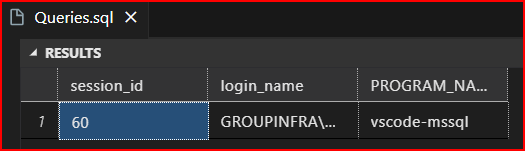
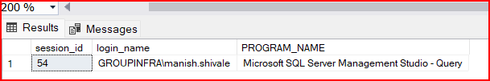

# Objective 01:

## Demonstrate how to create a trigger using Transact-SQL statement

### Error message when Trigger is executed.

        	Msg 3609, Level 16, State 2, Line 3
            The transaction ended in the trigger.
            The batch has been aborted.

- Level 16: Severity level 16 (range is 0 to 25) is considered a general error.

- State 2: this states that transaction ended due to issue within trigger.

- Line 3: It is the line within script or selection where error occured.

- Transaction ended in the trigger: this shows while running transaction, something within trigger that ended the transaction execution.

- Batch has been aborted: this means none of the statements within the batch have been successfully executed.

_So I created trg_Table_Safety to prevent DROP and ALTER any TABLE ON DATABASE and Trigger is working._

## Difference between FOR UPDATE and AFTER UPDATE.

**FOR UPDATE**:

- When a trigger is defined with FOR UPDATE, it is a *statement-level trigger* that fires before the actual data modification operation takes place but after the triggering SQL statement has been issued.

- This type of trigger allows you to examine the data being modified and potentially modify it further or perform additional actions before the modification is committed to the database.

- However, with FOR UPDATE, you cannot directly access the old and new values of the modified rows within the trigger. You typically use the INSERTED and DELETED pseudo-tables to access the data before and after the update operation.

**AFTER UPDATE**:

- When a trigger is defined with AFTER UPDATE, it is a *row-level trigger* that fires after the update operation has been completed and the changes have been committed to the database.

- *This type of trigger allows you to access both the old and new values of the modified rows using the INSERTED and DELETED pseudo-tables within the trigger.*

- AFTER UPDATE triggers are useful for logging changes, maintaining audit trails, enforcing business rules based on the updated data, or performing other actions that require access to the final state of the modified rows.

# Objective 02:

## Server Logon Tracking

- Check session id or SPID and login_name or SYSTEM USER

